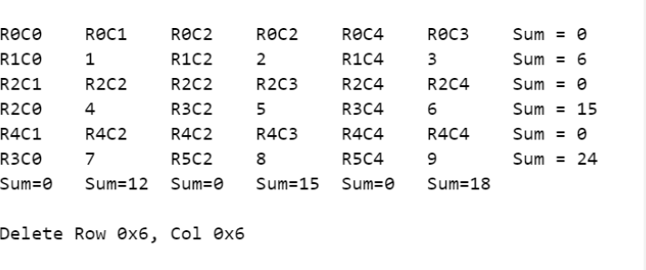

# Spreadsheet Replica
The program in a way implements an excel spreadsheet. There are two classes; 
SheetRow which makes a single row of the spreadsheet and Sheet which creates
a 9X9 spreadsheet with the help of SheetRow class. The program also adds the
elements in each row and column and displays the total of it. 

